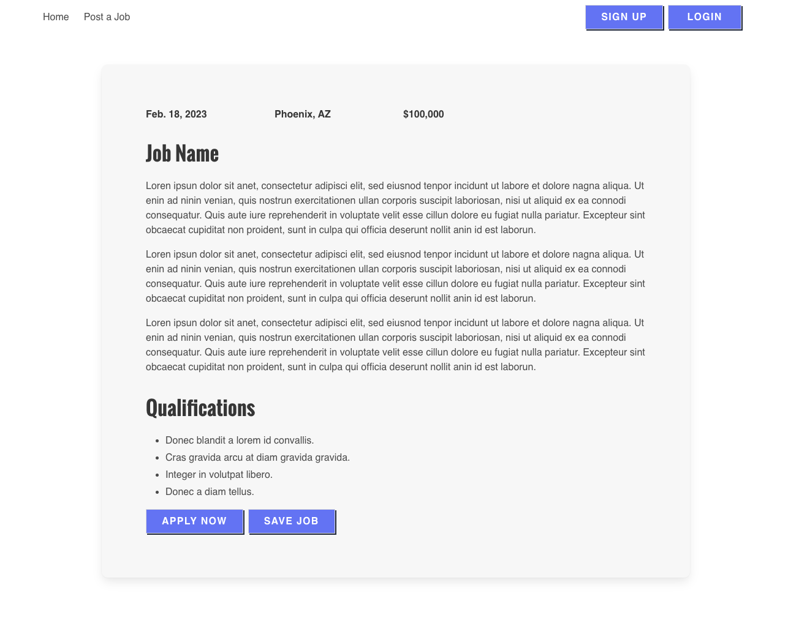

# get-a-job
Get a Job: Job Board

## Table of Contents
  - [Description](#description)
  - [Installation](#installation)
  - [Useage](#useage)
  - [Testing](#testing)
  - [Collaborators](#collaborators)
  - [Questions](#questions)

  ## Description
Attempted to build a Job Board site, where users can publish jobs, create an account, upload a resume, search jobs by keyword or location, and save job listings. This application's folder structure follows the Model-View-Controller paradigm and uses express-handlebars, MySQL2, Sequelize, dotenv, bcrypt, express-session and connect-session-sequelize packages. 

## Installation

  Installation of [MySQL 2](https://www.npmjs.com/package/mysql2)
  *  Use ``npm install --save mysql2``

  Installation of [Sequelize](https://www.npmjs.com/package/sequelize)
  * Use ``npm install``

 Installation of [dotenv](https://www.npmjs.com/package/dotenv)
  * Use ``npm install dotenv --save``

 Installation of [Express Handlebars](https://www.npmjs.com/package/express-handlebars)
  * Use ``npm install express-handlebars``

 Installation of [bcrypt](https://www.npmjs.com/package/bcrypt)
  * Use ``npm install bcrypt``

 Installation of [Connect Session Store using Sequelize](https://www.npmjs.com/package/connect-session-sequelize)
  * Use ``npm install connect-session-sequelize``

 Installation of [Express-session](https://www.npmjs.com/package/express-session)
  * Use ``npm install express-session``

  ## Technologies Used
  Bulma CSS Framework, GitHub, Node.js, Express.js, MySQL, Sequelize ORM

  ## Useage
  Use the command ``npm start`` to run the application on the localhost.

  ## Testing
  n/a

  ## Collaborators
 
Rachel Wildberger 
https://github.com/RachelWildberger

Achraf Chibane
https://github.com/Ash0422

Adrian Walkosz
https://github.com/awalkosz

Micah Sharifi

Brandon Kerns
https://github.com/btkerns96